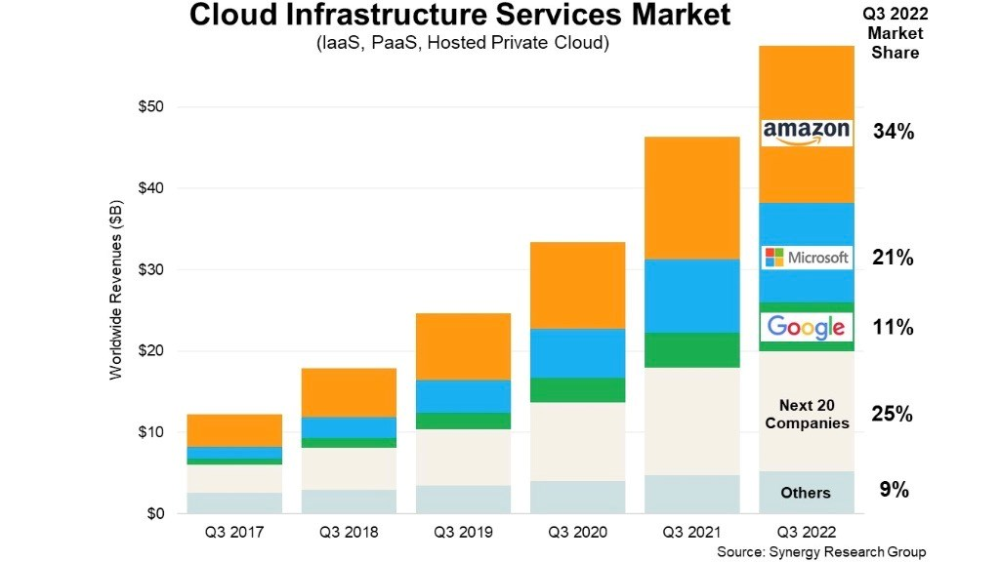

# Cloud Computing
***

## What is Cloud Computing? 
***

Cloud computing is technology that provides on-demand availability of data, resources and computing power over the internet
(cloud) instead of on local systems/servers. Large clouds are often distributed across multiple locations and typically 
operate on a pay-as-you-go pricing model.  
 
Some key characteristics of cloud are:

* On-Demand Self-Service 
* Broad Network Access
* Resource Pooling
* Rapid Elasticity
* Measured Service  
 
## Differences between on-prem and the cloud?
***

The primary difference between on-prem (on-premises) computing and cloud computing is the location. On-premises is installed and runs
of onsite and uses the company's own local hardware. Cloud computing is accessed over the internet and uses a provider's servers.   

This requires on-prem computing to have dedicated spaces for these servers and means the company has to maintain all hardware and
software whereas cloud computing does not require the company to have this dedicated space and the maintenance of the servers is 
done by the provider.

Some more differences:

|                    | On-perm                                                                                                                           |                                                                                                                                Cloud Computing |
|--------------------|-----------------------------------------------------------------------------------------------------------------------------------|-----------------------------------------------------------------------------------------------------------------------------------------------|
| **Cost Structure** | Requires significant capital expenditure for hardware, software and setup. Very high initial investment                           | Typically requires operational expenditure when using a pay-as-you-go model. Low initial costs but long-term costs depend on usage and scaling |
| **Scalability**    | Scaling up requires purchasing and installing more hardware and is limited by space                                               |                                         Can easily scale up or down depending on needs/demand and removes physical limitations for the company |
| **Maintenance**    | On-site IT team needed for hardware and software troubleshooting and administration                                               |                                                                         Service provider handles management, maintenance, updates and security |
| **Accessibility**  | Requires either direct connection to the business's network or remote access which may requires VPNs to ensure secure connections |                                                                                               Easily accessible through an internet connection |
| **Performance**    | Performance can be optimised around business needs and workloads and low latency for data processing due to local hardware        |                                                                                        Performance affected by internet bandwidth and latency. |  
 

## The 4 deployment models of cloud: private vs public vs hybrid vs multi-cloud
***

Private Cloud: Services are on a private network typically only accessed by one company.  
 
Public Cloud: Services are shared across organisations and accessed over the public internet.  
 
Hybrid Cloud: Combines public and private cloud and allows data and applications to be shared between them.  
 
Multi-cloud: Use of two or more different cloud services by an organisation.  
 

|                    | Private                                           | Public                                                        | Hybrid                                                                  | Multi                                                            |
|--------------------|---------------------------------------------------|---------------------------------------------------------------|-------------------------------------------------------------------------|------------------------------------------------------------------|
| **Ownership**      | Owned and managed by the organisation             | Owned and managed by the cloud service provider               | Owned by the organization and public cloud provider                     | Multiple cloud systems owned by organisation or service provider |
| **Cost Structure** | Primarily high CapEx with with ongoing OpEx costs | OpEx costs through pay-as-you-go pricing model                | Mixture of CapEx for private and OpEx for public                        | OpEx costs across multiple providers                             |
| **Scalability**    | Limited by physical resources and infrastructure  | Highly scalable and flexible, resources can be quickly scaled | Can scale public cloud when private cloud has reached capacity          | Scaling across multiple cloud environment                        |
| **Maintenance**    | Maintained by in-house IT team                    | Managed and maintained by provider                            | Requires maintenance of private system                                  | Managed by different providers across multiple cloud systems     |
| **Examples**       | Use of on-premises data centres                   | AWS, Microsoft Azure, Google Cloud Platform                   | Use of both on-premises data centres and a service provider such as AWS | Use of multiple providers at once, such as AWS and Azure         |
 

 ## Types of cloud services
***

Infrastructure as a Service (IaaS): Provides virtualized computing resources over the internet. IaaS includes services like 
virtual machines, storage, and networks.

Platform as a Service (PaaS): is a cloud computing platform where a third party offers the necessary software and hardware resources. 
Supplying an environment for developers to build, test, and deploy applications without worrying about the infrastructure.

Software as a Service (SaaS): Delivers software applications over the internet on a subscription basis. Users can access the 
software from any device with internet connectivity.  
 

|                      | IaaS                                                                 | PaaS                                                                     | SaaS                                                                     |
|----------------------|----------------------------------------------------------------------|--------------------------------------------------------------------------|--------------------------------------------------------------------------|
| **Management**       | Managed by the organisation (customer)                               | Managed by both organisation (application) and provider (infrastructure) | Fully managed by provider                                                |
| **Control Level**    | High level of control over infrastructure and operating systems      | Moderate control over deployed application and configurations            | Low level of control. Primarily limited to user-specified configurations |
| **Cost Structure**   | Pay-as-you-go for infrastructure usage                               | Pay-as-you-go or subscription for platform usage                         | Subscription-based pricing                                               | 
| **Deployment Speed** | Moderate to high; requires setting up and configuring infrastructure | Faster than IaaS. Focuses on application development                     | Fast and ready-to-use application                                        | 
| **Examples**         | AWS EC2, Microsoft Azure Virtual Machines                            | Google App Engine, Azure App Services, Heroku                            | Salesforce, Google Workspace                                             |  
 

## What are the advantages/disadvantages of the cloud businesses?
***

### Advantages of Cloud:

* Cost Effective through reduced CapEx by using pay-as-you-go model 
* Scalable and flexible by being able to easily scale up or down based on demand and accessibility over the internet
* Reliable with built-in redundancy and backup options for data recovery
* Services maintained by provides 
* Leading providers offer robust security measures such as encryption as well as identity and access management  
 

### Disadvantages of Cloud:
* Depends on internet connection which can cause unexpected downtime if there are connectivity issues
* Unexpected downtime can also occur if there are issues with the provider's infrastructure
* Data on the cloud is still at risk of data breaches
* Possibility of unexpected costs when resource consumption is not monitored  
 

For many businesses the advantages of cloud computing often outweigh the disadvantages. Although evaluating the needs and
potential risks is important.  
 

## Difference between OpEx vs CapEx and how it relates the cloud
***

Capital Expenditure (CapEX): The funds used by a company to purchase, upgrade or maintain physical assets. In relation to 
cloud this would refer to the costs of buying and maintaining cloud infrastructure and on-premises data centres. 
 
Operational Expenditure (OpEX): The costs of day-to-day operations within the organisation occurring regularly. In relation
to cloud this would refer to the costs of subscriptions or pay-as-you-go models for cloud services.

## Cloud market share breakdown
***

AWS is the leading cloud service provider with microsoft azure and goolge cloud following behind.